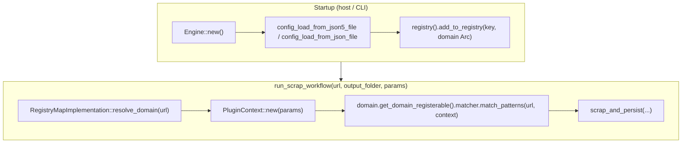
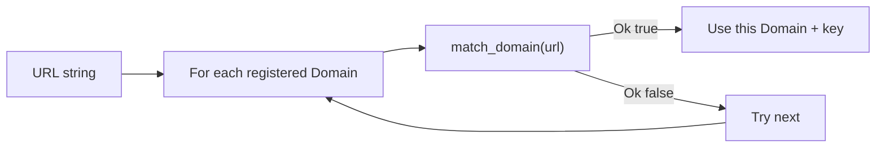

# `mangater-core` — generated contributor guide

This document expands on the draft in [README.md](./README.md) with behavior aligned to the current codebase. It focuses on the orchestration engine, what contributors should know about this crate, and how to plug in new site implementations (“plugins”).

---

## Role in the workspace

- **`mangater-sdk`** defines the contracts: `Domain`, `Registry`, `Matcher`, `Storage`, `UrlFilter`, `UrlRewriter`, `Config`, plus entities like `Registerable`, `PluginContext`, and `AppConfigJson5`.
- **`mangater-core`** is the default implementation of the **registry** (`RegistryMapImplementation`) and the **orchestration engine** (`Engine`) that turns those contracts into download, transform, and persist steps.

A typical host (for example the CLI) constructs an `Engine`, loads `AppConfigJson5`, registers one or more `Domain` implementations, and then calls `run_scrap_workflow`.

---

## 1. Orchestration flow (with diagrams)

### 1.1 End-to-end: from URL to persistence

The registry holds `Arc<dyn Domain>` entries. Resolution walks registered domains until `match_domain(url)` returns true; the engine then uses that domain’s `Registerable` bundle.



**Important details in code:**

- If no domain matches, the engine returns `SdkError::Unsupported(url)`.
- If `output_folder` is `Some`, it **overrides** `config.core.storage.root_folder` for that run (see `run_scrap_workflow` in `orchestration/engine.rs`).

### 1.2 Domain resolution (first match wins)

`resolve_domain` iterates keys in insertion order; the first `Domain` for which `match_domain` returns `Ok(true)` is selected.



If your site plugin never matches, check regex / URL rules in `match_domain` and ensure registration uses the expected key.

### 1.3 `scrap_and_persist` — download, pattern fan-out, concurrency

After patterns are known:

1. Optionally fetch page HTML: if `PluginContext` has `scrap_content == "true"`, the engine downloads the main URL (UTF-8 body). For the moment, only the `wikipedia` plugin has this config option.
2. Each `PatternMatchResult` is processed as an async task; tasks run with **bounded concurrency** from `config.core.max_concurrency` (minimum effective value is 1; `0` is treated as 1).
3. The first `Err` in the batch is propagated (earlier work may have partially completed).

```mermaid
flowchart TB
  subgraph fetch["Page body"]
    Q{"plugin_context.get(\"scrap_content\") == \"true\" ?"}
    DL["download_resource(url) → UTF-8 string"]
    Q -->|yes| DL
    Q -->|no| EMPTY["empty string body"]
  end

  subgraph patterns["Per PatternMatchResult (concurrent)"]
    PT{"PatternType"}
    PT -->|Content| C["clean_html_content → storage.persist or default file"]
    PT -->|Resource| R["parse_images / filter / rewrite → download each → persist"]
    PT -->|ActualUri| A["resolve URL, optional User-Agent from pattern → download → persist"]
    PT -->|Pagination / ScrapedContent / Others| W["log warn; no-op for now"]
  end

  fetch --> patterns
```

**Supported pattern handling today (high level):**

| `PatternType`   | Engine behavior (current) |
|-----------------|-----------------------------|
| `Content`       | HTML cleaned; custom `Storage` or filesystem under `root_folder` |
| `Resource`      | `pattern == "img"`: images from HTML, with optional `UrlFilter` / `UrlRewriter`; then persist |
| `ActualUri`     | Fetch `resource_string` (after filter/rewrite), optional user-agent provided by the plugin |
| `Pagination`    | to be implemented |
| `ScrapedContent`| to be implemented |
| `Others`        | to be implemented |

**Failure semantics:** Missing network resources often **warn** and continue; **persist** failures from `Storage` or disk typically return `SdkError`.

---

## 2. What else contributors should know

### 2.1 Configuration shape (`AppConfigJson5`)

Loaded by the engine (JSON or JSON5):

- `core.storage.root_folder` — default location for filesystem output when a plugin has no `Storage` impl.
- `core.max_concurrency` — cap for parallel pattern work (see §1.3).
- `core.proxy` — present in the model for future or downstream use; wiring depends on the host.
- `plugins` — a `HashMap` of `serde_json::Value`; **plugins that need a typed config section** should implement `mangater_sdk::traits::Config` and read from this map (see the Wikipedia example in the CLI).
```rust
let mut wikipedia = WikipediaInstance::new();
// Plugins requiring a custom config section must implement `Config`.
wikipedia.load(app_config.plugins.clone()).unwrap();
```

<!-- Separately, **`util::config`** offers **`load_from_env`** (dotenvy) and **`load_from_json`** (raw string). Those are **not** the same as `Engine::config_load_*` — the engine deserializes **full** `AppConfigJson5`; the `util` helpers are lower-level file/env helpers for other integration patterns. -->

### 2.2 Filesystem layout helpers (`util::file_location`)

When `Registerable.storage` is `None`, the engine persists using `generate_file_path_to_persist` and related URL helpers. Paths are derived from the URL’s domain, path segments, and optional `chapter` / `filepath` (the latter is important for `PatternType::ActualUri` and `additoinal_params` such as `chapter_id` / `filepath` provided by the plugin).

Contributors working on new persistence layouts should read `util/file_location.rs` before reimplementing path rules.

### 2.3 Observability

The engine and helpers use `tracing`. When debugging workflows, set `RUST_LOG` and follow spans from `resolve_domain` through pattern execution.

### 2.4 Tests and fixtures

`orchestration/engine.rs` includes integration-style tests (for example `scrap_and_persist_resource` / content paths) with fixtures under `testdata/`. When changing persist or download behavior, run:

`cargo test -p mangater-core`

---

## 3. Plugin / site development: how to use `mangater-core`

### 3.1 Minimal mental model

1. Implement **`Domain`** for your site (match URLs, return a stable `get_domain_key()`, and build a **`Registerable`** from `get_domain_registerable()`).
2. Implement **`Matcher`** (usually on the same struct): return `PatternMatchResult` list for a URL, optionally **mutate `PluginContext`** to control the engine (for example set `scrap_content` to `"true"` when HTML is required for `Resource` patterns; currently only `wikipedia` plugin needs this flag during the scrapping process).
3. Optionally implement **`UrlFilter`**, **`UrlRewriter`**, and **`Storage`**; wire them in `Registerable` as `Option<Arc<...>>`.
4. On startup, obtain **`engine.registry()`** as `&mut dyn Registry` and call **`add_to_registry(Some(key), Arc::new(your_domain))`**.

Reference integration: `mangater-cli/src/util/cli_engine.rs` shows `Engine::new()`, config load, plugin `load()` where needed, and `add_to_registry`.

### 3.2 `PluginContext` and `scrap_content`

- Params come from the host (for example CLI flags mapped into a `HashMap<String, String>`).
- The **matcher** can add keys. For the Wikipedia plugin, the matcher sets `scrap_content` to `true` so the engine fetches the HTML before `PatternType::Resource` runs.
- If the matcher does not set `scrap_content` and the engine has no page body, resource and content paths that depend on HTML will see an empty string — match your patterns to the fetch policy.

### 3.3 `PatternMatchResult` fields

- **`pattern`:** For `Resource` with `pattern == "img"`, the engine uses image extraction. For `ActualUri`, a **non-empty** `pattern` is interpreted as a **User-Agent** string for the download. Other `PatternType` values use `pattern` in context-specific ways (e.g. content cleaning selector for `Content`).
- **`resource_string` / `additoinal_params`:** Used for `ActualUri` and file naming; see `scrap_provided_uri_and_persist` in `engine.rs` for the exact `chapter` / `filepath` behavior.

### 3.4 Registry keys

`add_to_registry` accepts an optional key; if `None`, the map uses `domain.get_domain_key()`. Keep keys **unique and stable** so operators can reason about `list_registered_domains` and resolution order.

### 3.5 When to depend on `mangater-core` vs only `mangater-sdk`

- **Plugin crate:** Usually depends on **`mangater-sdk`** only, and is **registered by the host** that also depends on `mangater-core` (or another orchestrator that implements the same `Registry` contract).
- **New runner / binary:** Depends on **`mangater-core`**, loads config, registers plugins, and calls `Engine` methods.

---

## 4. Quick glossary

| Term | Meaning here |
|------|----------------|
| **Engine** | Orchestrates config, registry, fetch, per-pattern work, and default file persistence |
| **RegistryMapImplementation** | In-memory `HashMap` of domains implementing `mangater_sdk::traits::Registry` |
| **Registerable** | Bundle of matcher, optional storage, filter, rewriter, and optional custom config |
| **Plugin** | A `Domain` (and its `Registerable` traits) registered for a site or family of URLs |

---

*This file is a generated/expanded guide; prefer the source of truth in `src/orchestration/engine.rs` and `mangater-sdk` for exact signatures and future behavior.*
